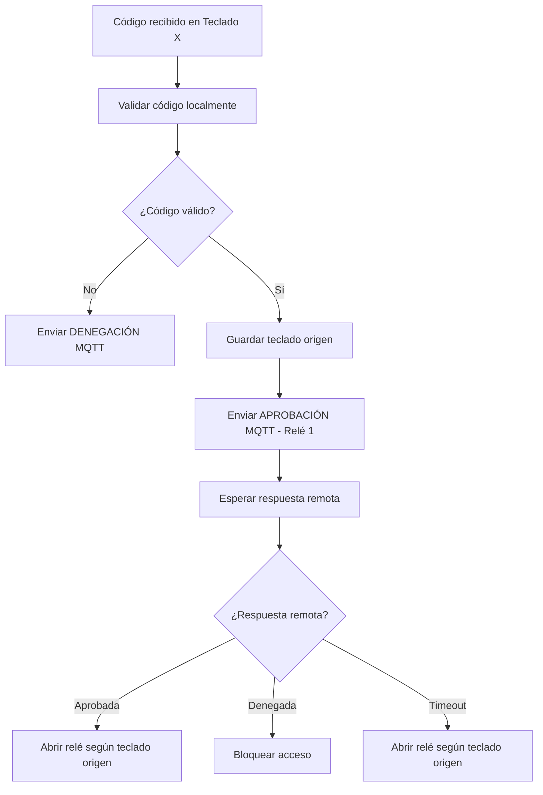

# 🔄 Análisis del Modo Torno - Sistema KC868A2

## 📋 **Resumen Ejecutivo**

El modo torno es una funcionalidad avanzada que permite a la controladora KC868A2 actuar como un sistema de control de acceso bidireccional, donde cada teclado controla un relé específico, pero la comunicación MQTT se simplifica para mantener compatibilidad con sistemas externos.

## 🎯 **Objetivos del Modo Torno**

### **1. Control Bidireccional**
- **Teclado 1** → Controla **Relé 1** (entrada/salida específica)
- **Teclado 2** → Controla **Relé 2** (entrada/salida específica)
- **Comunicación MQTT** simplificada (siempre relé 1)

### **2. Gestión Inteligente de Accesos**
- **Retención** del teclado origen durante validación
- **Apertura** del relé correcto según teclado origen
- **Compatibilidad** con sistemas MQTT existentes

## 🔧 **Análisis Técnico**

### **Modo Normal vs Modo Torno**

| Aspecto | Modo Normal | Modo Torno |
|---------|-------------|------------|
| **Comunicación MQTT** | Relé específico por código | Siempre relé 1 |
| **Apertura Local** | Relé definido por código | Relé según teclado origen |
| **Configuración** | Por código individual | Por teclado global |
| **Flexibilidad** | Alta (código → relé) | Media (teclado → relé) |

### **Flujo de Operación - Modo Torno**



## 🗄️ **Estructura de Datos Requerida**

### **1. Configuración del Modo Torno**
```cpp
struct TurnstileConfig {
  bool enabled;           // true = modo torno, false = modo normal
  uint8_t keyboard1_relay; // Relé asignado al teclado 1 (1 o 2)
  uint8_t keyboard2_relay; // Relé asignado al teclado 2 (1 o 2)
  uint8_t reserved[5];    // Reservado para futuras extensiones
};
```

### **2. Gestión de Solicitudes Pendientes**
```cpp
struct PendingRequest {
  bool active;            // true si hay solicitud pendiente
  uint8_t keyboard_id;    // Teclado origen (1 o 2)
  char code[17];          // Código introducido
  char type[5];           // Tipo de código (PIN/TAG)
  unsigned long timestamp; // Timestamp de la solicitud
  uint8_t relay_to_open;  // Relé que se abrirá si se aprueba
};
```

### **3. Estructura de Configuración Principal**
```cpp
struct Config {
  // ... configuración existente ...
  TurnstileConfig turnstile; // Nueva configuración de torno
};
```

## 🔄 **Flujo de Validación - Modo Torno**

### **1. Recepción de Código**
```cpp
void validateCode(String code, String type, int keyboardId) {
  if (config.turnstile.enabled) {
    // Modo torno activo
    int relayToOpen = (keyboardId == 1) ? config.turnstile.keyboard1_relay 
                                        : config.turnstile.keyboard2_relay;
    
    // Guardar solicitud pendiente
    pendingRequest.active = true;
    pendingRequest.keyboard_id = keyboardId;
    pendingRequest.relay_to_open = relayToOpen;
    strcpy(pendingRequest.code, code.c_str());
    strcpy(pendingRequest.type, type.c_str());
    pendingRequest.timestamp = millis();
    
    // Enviar siempre como relé 1 para MQTT
    publishAccessRequest(code, type, 1);
  } else {
    // Modo normal - lógica existente
    // ...
  }
}
```

### **2. Procesamiento de Respuesta MQTT**
```cpp
void processMqttResponse(String response) {
  if (config.turnstile.enabled && pendingRequest.active) {
    if (response == "APPROVED") {
      // Abrir relé según teclado origen
      controlReleWithDuration(releDuration, pendingRequest.relay_to_open);
      Serial.printf("✅ Torno: Abriendo relé %d (teclado %d)\n", 
                   pendingRequest.relay_to_open, pendingRequest.keyboard_id);
    } else {
      Serial.printf("❌ Torno: Acceso denegado (teclado %d)\n", 
                   pendingRequest.keyboard_id);
    }
    
    // Limpiar solicitud pendiente
    clearPendingRequest();
  }
}
```

## 🌐 **Interfaz Web - Configuración del Modo Torno**

### **1. Nueva Sección en Configuración**
```html
<div class="turnstile-config">
  <h2>🔄 Configuración del Modo Torno</h2>
  
  <form action="/config/turnstile" method="post">
    <label>
      <input type="checkbox" name="enabled" value="1" 
             <?php echo $turnstile_enabled ? 'checked' : ''; ?>>
      Activar Modo Torno
    </label>
    
    <div class="keyboard-mapping">
      <h3>Asignación de Teclados a Relés</h3>
      
      <div class="mapping-row">
        <label>Teclado 1 (GPIO 33/14):</label>
        <select name="keyboard1_relay">
          <option value="1" <?php echo $keyboard1_relay == 1 ? 'selected' : ''; ?>>
            Relé 1
          </option>
          <option value="2" <?php echo $keyboard1_relay == 2 ? 'selected' : ''; ?>>
            Relé 2
          </option>
        </select>
      </div>
      
      <div class="mapping-row">
        <label>Teclado 2 (GPIO 4/16):</label>
        <select name="keyboard2_relay">
          <option value="1" <?php echo $keyboard2_relay == 1 ? 'selected' : ''; ?>>
            Relé 1
          </option>
          <option value="2" <?php echo $keyboard2_relay == 2 ? 'selected' : ''; ?>>
            Relé 2
          </option>
        </select>
      </div>
    </div>
    
    <button type="submit">💾 Guardar Configuración</button>
  </form>
</div>
```

### **2. Información de Estado**
```html
<div class="turnstile-status">
  <h3>Estado del Modo Torno</h3>
  <p><strong>Modo:</strong> 
    <span class="status-badge <?php echo $turnstile_enabled ? 'active' : 'inactive'; ?>">
      <?php echo $turnstile_enabled ? 'Torno Activo' : 'Normal'; ?>
    </span>
  </p>
  
  <?php if ($turnstile_enabled): ?>
  <p><strong>Mapeo:</strong></p>
  <ul>
    <li>Teclado 1 → Relé <?php echo $keyboard1_relay; ?></li>
    <li>Teclado 2 → Relé <?php echo $keyboard2_relay; ?></li>
  </ul>
  
  <?php if ($pending_request_active): ?>
  <div class="pending-request">
    <p><strong>⚠️ Solicitud Pendiente:</strong></p>
    <p>Código: <?php echo $pending_code; ?> (<?php echo $pending_type; ?>)</p>
    <p>Teclado: <?php echo $pending_keyboard; ?></p>
    <p>Relé a abrir: <?php echo $pending_relay; ?></p>
  </div>
  <?php endif; ?>
  <?php endif; ?>
</div>
```

## 📡 **Comunicación MQTT - Modo Torno**

### **1. Mensajes de Solicitud**
```json
{
  "device": "KC868A2-001",
  "timestamp": 1703123456,
  "type": "access_request",
  "data": {
    "code": "1234",
    "code_type": "PIN",
    "keyboard_id": 1,
    "relay": 1,
    "mode": "turnstile"
  }
}
```

### **2. Mensajes de Respuesta**
```json
{
  "device": "KC868A2-001",
  "timestamp": 1703123456,
  "type": "access_response",
  "data": {
    "code": "1234",
    "code_type": "PIN",
    "keyboard_id": 1,
    "relay_opened": 2,
    "status": "APPROVED",
    "mode": "turnstile"
  }
}
```

## ⚠️ **Consideraciones de Seguridad**

### **1. Timeout de Solicitudes**
- **Tiempo máximo**: 30 segundos
- **Comportamiento**: Apertura automática si no hay respuesta
- **Logging**: Registro de timeouts

### **2. Gestión de Solicitudes Concurrentes**
- **Una solicitud** activa por vez
- **Rechazo** de nuevas solicitudes durante validación
- **Limpieza** automática de solicitudes expiradas

### **3. Validación de Configuración**
- **Relés diferentes**: Teclado 1 y 2 no pueden usar el mismo relé
- **Valores válidos**: Solo relé 1 o 2
- **Persistencia**: Configuración guardada en EEPROM

## 🔄 **Migración y Compatibilidad**

### **1. Compatibilidad con Modo Normal**
- **Códigos existentes**: Funcionan sin cambios
- **Configuración**: Se preserva al cambiar modos
- **MQTT**: Mensajes compatibles con sistemas existentes

### **2. Migración de Configuración**
```cpp
void migrateToTurnstileMode() {
  if (config.turnstile.enabled) {
    // Configuración por defecto
    config.turnstile.keyboard1_relay = 1;
    config.turnstile.keyboard2_relay = 2;
    
    // Limpiar solicitudes pendientes
    clearPendingRequest();
    
    Serial.println("🔄 Modo torno activado");
  }
}
```

## 📊 **Casos de Uso**

### **Caso 1: Control de Entrada/Salida**
```
Configuración:
- Teclado 1 → Relé 1 (Entrada)
- Teclado 2 → Relé 2 (Salida)

Flujo:
1. Usuario introduce código en Teclado 1
2. Sistema envía solicitud MQTT (relé 1)
3. Sistema remoto aprueba
4. Se abre Relé 1 (entrada)
```

### **Caso 2: Control de Acceso Restringido**
```
Configuración:
- Teclado 1 → Relé 1 (Área A)
- Teclado 2 → Relé 2 (Área B)

Flujo:
1. Usuario introduce código en Teclado 2
2. Sistema envía solicitud MQTT (relé 1)
3. Sistema remoto aprueba
4. Se abre Relé 2 (área B)
```

## 🚀 **Plan de Implementación**

### **Fase 1: Estructuras de Datos**
- [ ] Definir `TurnstileConfig`
- [ ] Definir `PendingRequest`
- [ ] Actualizar `Config` principal
- [ ] Implementar persistencia EEPROM

### **Fase 2: Lógica de Validación**
- [ ] Modificar `validateCode()`
- [ ] Implementar gestión de solicitudes pendientes
- [ ] Añadir timeout y limpieza automática

### **Fase 3: Interfaz Web**
- [ ] Crear formulario de configuración
- [ ] Añadir información de estado
- [ ] Implementar handlers de configuración

### **Fase 4: Comunicación MQTT**
- [ ] Modificar mensajes de solicitud
- [ ] Actualizar procesamiento de respuestas
- [ ] Añadir logging específico

### **Fase 5: Testing y Validación**
- [ ] Pruebas de funcionalidad
- [ ] Validación de seguridad
- [ ] Documentación de usuario

---

**📅 Fecha de Análisis**: $(date)
**🔧 Estado**: Análisis completado
**📋 Próximo Paso**: Implementación de estructuras de datos
